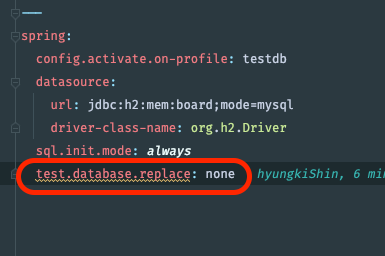
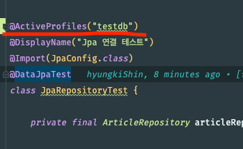

### 모든 데이터 베이스 보여줘 
show databases;

### 데이터 베이스 생성 <board>
create database board;

### shin 이라는 유저를 생성할꺼고,  비밀번호는 1234 이라고 할꺼야
create user 'shin'@'localhost' identified by '1234';

### mysql 의 유저를 보여줘
select `user` from `mysql`.`user`;

### shin 이라는 유저의 권한을 보여줘
show grants for `shin`@`localhost`;

### shin 이라는 유저에게 board 데이터 베이스에 모든 권한을 줄꺼야
grant all on `board`.* to `shin`@`localhost` with grant option;

### 권한을 flush
flush privileges;

### 짜증나는 이슈
- brew install mysql 
    - mysql -u root -p
    - 2002(HY000): '/tmp/mysql.sock' 소켓을 통해 로컬 MySQL 서버에 연결할 수 없습니다 ???
- 해결은 brew services start mysql
    - mysql 터미널에서 명령을 사용하려면 먼저 MySQL 을 시작해야 한다고 한다.
    - 정말 짜증난다 시간아까워
- local mysql 중지 명령어는 mysql.server stop
  grant all privileges on *.* to root@'%' identified by '' with grant option;

### yaml 파일에 mysql 설정
- spring:
    datasource:
        url: jdbc:mysql://localhost:3306/board?serverTimezone=UTC&characterEncoding=UTF-8
        username: shin
        password: 1234
        driver-class-name: com.mysql.cj.jdbc.Driver
- mysql 의 버전이 8.0 이상이면 serverTimezone=UTC&characterEncoding=UTF-8 를 추가해줘야 한다.

### yaml 파일에 spring 에 대한 설정을 추가시

--- <- 대쉬 세번 연속으로 달아줄 시 한문단의 새로운 spring 설정이 시작됨을 알릴 수 있다.

- 빨간 테두리 처럼 설정을 하고싶다면 Test file 에 testdb 라는 이름을 설정해줘야 하는데,
- DataJpaTest 가 뜻대로 작동하게 두질 않는다. Test AutoConfiguration 이 자기가 지정한 testdb 를 띄워줘 버려서 막아버린다. 

- 이러한 테스트 db 를 정의할 수 있게 해주는 코드가 @AutoConfigureTestDatabase(replace = AutoConfigureTestDatabase.Replace.NONE) 이다.
- 이 코드를 추가해주면 testdb 를 띄워주지 않고, application.yml 에 정의된 db 를 사용하게 된다.