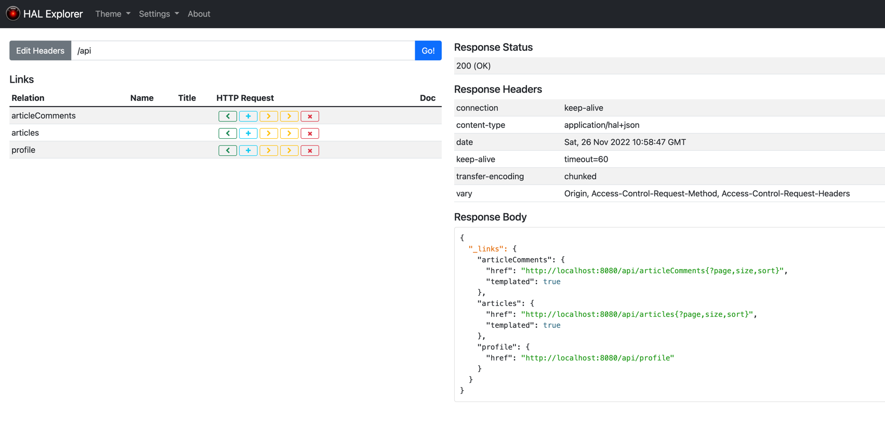
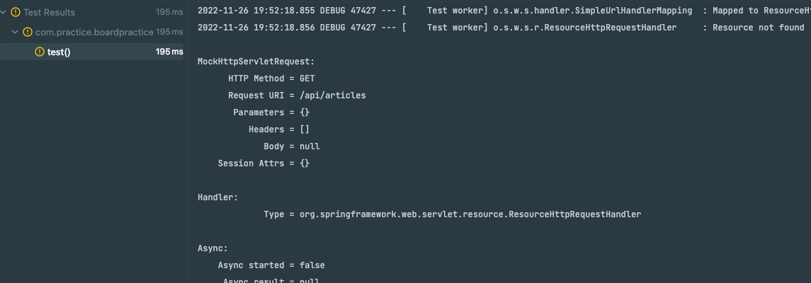
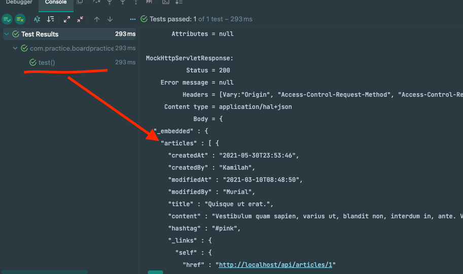
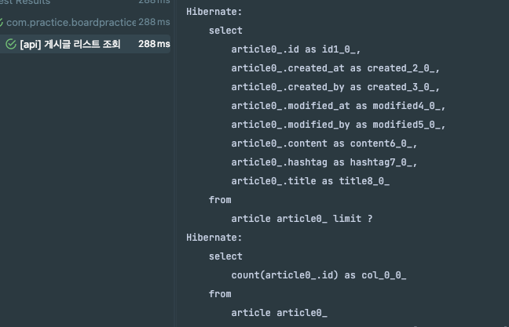

### WebMVC test 
- hal explorer 로 테스트 하기
- 먼저 build.gradle 에 의존성 추가
  - implementation 'org.springframework.boot:spring-boot-starter-data-rest'
  - implementation 'org.springframework.data:spring-data-rest-hal-explorer'

- application.yml 에 hal explorer 설정 추가
```yaml
spring
...
    data:
      rest:
        base-path: /api
        detection-strategy: annotated
``` 

- repository 에 어노테이션 추가
    - @RepositoryRestResource <- 
```java

package com.practice.boardpractice.repository;

import com.practice.boardpractice.domain.ArticleComment;
import org.springframework.data.jpa.repository.JpaRepository;
import org.springframework.data.rest.core.annotation.RepositoryRestResource;

@RepositoryRestResource // 요기
public interface ArticleCommentRepository extends JpaRepository<ArticleComment, Long> {
}

```
### 자알 뜨는지 확인해보자.
- http://localhost:8080/api



...! 심지어 예뻐 보인다.

### 확인했으니 테스트 코드 작성해보자.
- 테스트 코드 작성
```java
package com.practice.boardpractice.controller;


import org.junit.jupiter.api.Test;
import org.springframework.beans.factory.annotation.Autowired;
import org.springframework.boot.test.autoconfigure.web.servlet.WebMvcTest;
import org.springframework.http.MediaType;
import org.springframework.test.web.servlet.MockMvc;
import org.springframework.test.web.servlet.request.MockMvcRequestBuilders;

import static org.springframework.test.web.servlet.request.MockMvcRequestBuilders.get;
import static org.springframework.test.web.servlet.result.MockMvcResultMatchers.content;
import static org.springframework.test.web.servlet.result.MockMvcResultMatchers.status;

@WebMvcTest
public class DataRestTest {

    private final MockMvc mvc;

    public DataRestTest(@Autowired MockMvc mvc) {
        this.mvc = mvc;
    }

    @Test
    void test() throws Exception {
        // Given

        // When & Then
        mvc.perform(get("/api/articles"))
                .andExpect(status().isOk())
                .andExpect(content().contentType(MediaType.valueOf("application/hal+json")))
                .andDo(print());
    
    }
}

```

### 테스트 결과


- 왜 실패하는가 ?
  - WebMvc 는 슬라이스 테스트다.
  - 슬라이스 테스트는 테스트 대상 클래스의 의존성을 제외한 나머지 클래스들을 빈으로 등록한다.
  - 컨트롤러 외에 빈들을 로드하지 않는다. (컨트롤러와 연관된 bean 들을 최소한으로 읽어들인다.)
  - 따라서, dataRest 의 autoconfiguration 이 빈으로 등록되지 않는다. 
  - 그래서, hal explorer 가 빈으로 등록되지 않는다.

- 그럼 따로 넣어주는 방법이 있지 않은가 ?
  - 방법은 있겠지만 번거롭고 귀찮다.
  - 그냥 @SpringBootTest 를 사용하자.

```yaml
package com.practice.boardpractice.controller;


import org.junit.jupiter.api.Test;
import org.springframework.beans.factory.annotation.Autowired;
import org.springframework.boot.test.autoconfigure.web.servlet.AutoConfigureMockMvc;
import org.springframework.boot.test.autoconfigure.web.servlet.WebMvcTest;
import org.springframework.boot.test.context.SpringBootTest;
import org.springframework.http.MediaType;
import org.springframework.test.web.servlet.MockMvc;
import org.springframework.test.web.servlet.request.MockMvcRequestBuilders;

import static org.springframework.test.web.servlet.request.MockMvcRequestBuilders.get;
import static org.springframework.test.web.servlet.result.MockMvcResultMatchers.content;
import static org.springframework.test.web.servlet.result.MockMvcResultMatchers.status;

//@WebMvcTest
@AutoConfigureMockMvc
@SpringBootTest
public class DataRestTest {

    private final MockMvc mvc;

    public DataRestTest(@Autowired MockMvc mvc) {
        this.mvc = mvc;
    }

    @Test
    void test() throws Exception {
        // Given

        // When & Then
        mvc.perform(get("/api/articles"))
                .andExpect(status().isOk())
                .andExpect(content().contentType(MediaType.valueOf("application/hal+json")))
                .andDo(print());
    }
}

```

### 테스트가 잘 통과되는것을 확인할 수 있다.


### 참고로 해당 내용은 integration test 다
- 그리하여 ... 

- repository 를 전부 실행해서 db 에 영향을 준것을 확인했다.
- @Transactional 을 최상위에 붙여주자.
- Began transaction ~  Rolled back transaction for test: 로 트랜잭션이 시작되고 닫히는것을 알 수 있다.

### 단점
- 무겁다..